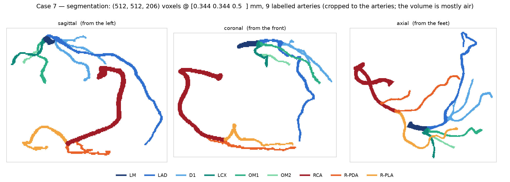
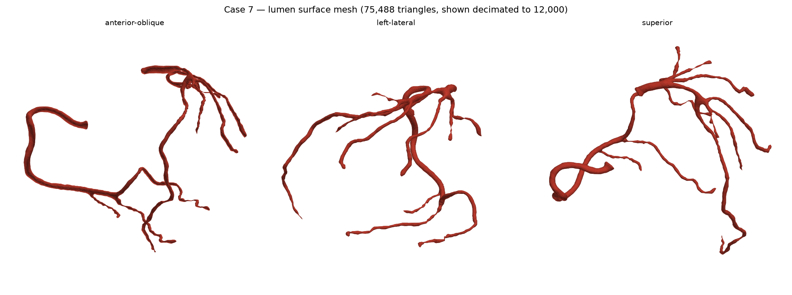
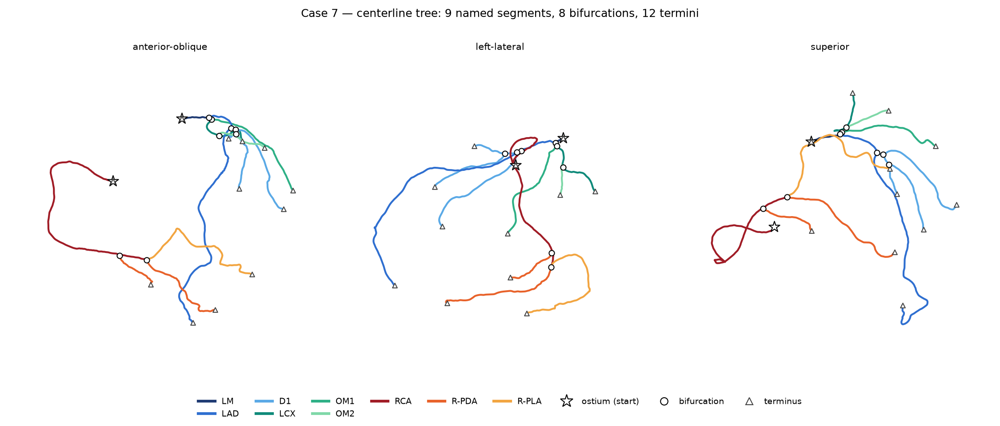
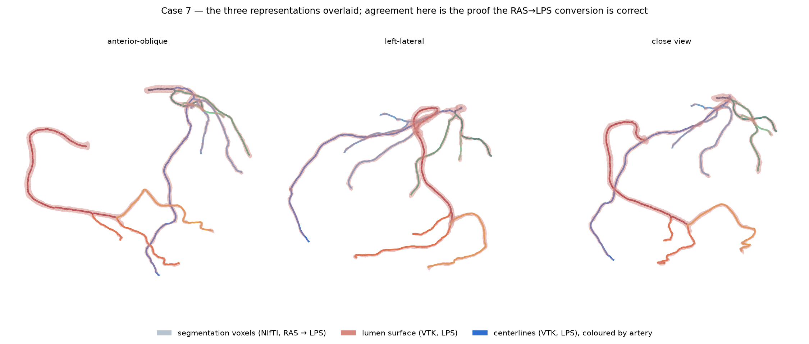
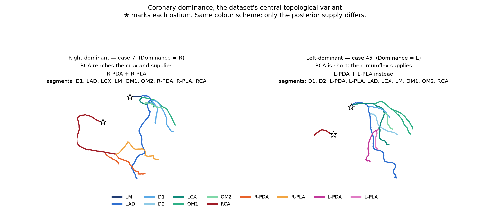

# Seeing ImageCAS-X in action

A first look at the data: what the three representations are, how they fit together, and what the
dataset is actually telling us. Figures are in `figures/`, regenerated with the commands at the bottom.

## Three views of the same tree

Every case is stored three ways, and they describe the same coronary tree at different levels of
abstraction:

| representation | format | what it is | good for |
|---|---|---|---|
| `segmentations/` | `.nii.gz`, uint8 | the voxel ground truth, one label per artery | training a segmentation model (objective 5) |
| `surfaces/` | `.vtk` ASCII polydata | triangulated lumen surface, ~75k triangles | geometry, radius, visualisation |
| `centerlines/` | `.vtk` binary polydata | the tree as polylines, split left/right | **topology (objectives 6–7)** |


*Case 7, the voxel labels. The stored volume is 512×512×206 but the arteries occupy a tiny fraction of
it — this is cropped to the anatomy. Colour = artery label.*


*The same case as a lumen surface mesh.*


*The same case as a centerline tree. This is the representation the thesis actually needs: it carries
per-point artery names, and flags for ostia, bifurcations and termini.*

The centerlines are the most valuable of the three for this thesis. Beyond the geometry they carry
four point arrays that were not obvious from the file listing:

- `segment_label` — integer artery id, **the same integers used in the segmentation volumes**
- `segment_name` — the artery name as a string (`LAD`, `RCA`, …)
- `start_points`, `branch_points`, `end_points` — 0/1 flags marking ostia, bifurcations and termini

Those last three are precomputed tree topology, handed over for free. Branch counts and branching
patterns (objective 7) can be read off them directly rather than derived from scratch.

## The trap: two coordinate conventions

The three representations do **not** share a coordinate frame, and nothing in the data warns you.

- NIfTI affines are **RAS** by definition (x = Right, y = Anterior, z = Superior).
- The VTK centerlines and surfaces are **LPS** (x = Left, y = Posterior), the ITK/VTK convention.

They differ by a sign flip on x and y: `LPS = diag(-1, -1, 1) · RAS`. Overlay them without converting
and you get a picture that looks perfectly plausible and is completely wrong — the trees are roughly
symmetric, so a mirrored overlay still looks like a heart. Any feature mixing voxel and mesh data would
be silently corrupted.

`src/imagecasx/coords.py` handles this. Always go through it.


*The alignment proof. With the conversion applied, centerlines run down the middle of the surface
tubes, which sit on the segmentation voxels. Quantitatively: **100% of centerline points land on a
labelled voxel, and 100% of them agree with that voxel's label.** Exact, not approximate.*

## What the labels mean

The segmentations are multi-label, with values 1–14, and the meaning was undocumented. Because the
centerlines carry both the integer label and the artery name, and the label spaces turn out to be
identical, the mapping can be read straight off the data and verified against the voxels
(`scripts/derive_label_map.py`, 36 cases, 100% agreement):

| | | | | |
|---|---|---|---|---|
| 1 `LM` | 2 `LAD` | 3 `LCX` | 4 `D1` | 5 `D2` |
| 6 `OM1` | 7 `OM2` | 8 `IM` | 9 `RCA` | 10 `R-PDA` |
| 11 `R-PLA` | 12 `L-PDA` | 13 `L-PLA` | 14 `Other` | |

Labels 1–8 are the left system, 9–11 the right, 12–13 the posterior vessels in left-dominant hearts.
Left and right centerline files use disjoint label ranges.

## The story the data tells

**Which labels a case has is anatomy, not noise.** Earlier the varying label counts looked like
annotation inconsistency. They are not — they are real anatomical variation, and it is systematic:

| label | artery | R-dominant | L-dominant | codominant |
|---|---|---|---|---|
| 10 | `R-PDA` | 12/12 | **0/12** | 8/12 |
| 11 | `R-PLA` | 12/12 | **0/12** | 6/12 |
| 12 | `L-PDA` | **0/12** | 10/12 | 4/12 |
| 13 | `L-PLA` | **0/12** | 11/12 | 10/12 |

The posterior descending and posterolateral arteries arise from the *dominant* vessel, so `R-PDA`
never appears in a left-dominant heart and `L-PDA` never appears in a right-dominant one. The
`Dominance` column in `Descriptors.xlsx` and the segmentation labels are two independent recordings of
the same fact, and they agree perfectly. Each validates the other.


*Right- vs left-dominant. Same colour scheme; the difference is entirely in the posterior supply. In
case 45 the RCA is a short stub and the magenta L-PDA/L-PLA come off the left system instead.*

Label 8, `IM` (ramus intermedius), tells a similar story: present in 9 of 36 sampled cases, ≈25%,
matching the textbook prevalence of that variant. The dataset's "inconsistency" is a faithful record of
how much coronary trees genuinely differ between people — which is precisely what the thesis sets out
to characterise.

One caveat: label 14 is `Other`, a catch-all. Anything relying on complete anatomical labelling should
treat it as unlabelled rather than as a specific artery.

## Reproducing

```bash
source env.sh
python scripts/derive_label_map.py --n 12      # writes docs_thesis/label_map.json
python scripts/make_case_figures.py 7          # writes figures/7_0{1..4}_*.png
python scripts/make_dominance_figure.py        # writes figures/05_dominance_comparison.png
```

All of it runs on the login node in well under a minute; no GPU or `bsub` needed. Rendering is
matplotlib-only because the login node has no `DISPLAY` — PyVista is used purely as a file parser.
