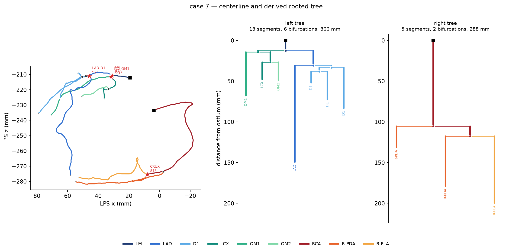
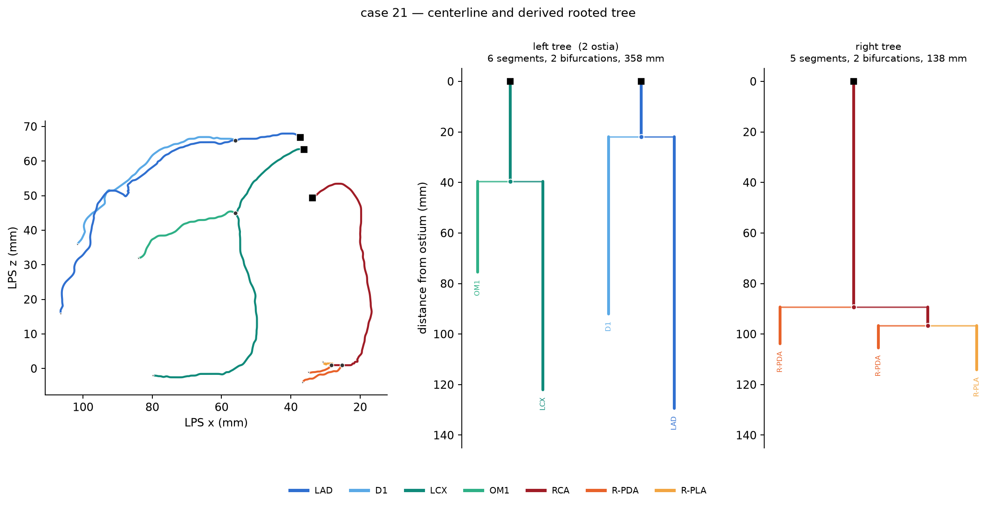

# From centerlines to rooted trees

Everything in objectives 6–9 is computed on a graph, so this is the step that has to be right.
This note records what the centerline data actually contains, how `topology.graph` turns it into a
rooted tree, and how the result was validated across all 1600 sides.

## The centerlines are already a graph

The `.vtk` centerlines are not a bag of curves that has to be re-stitched by proximity. They carry
explicit connectivity, and it is exact. Verified over the full cohort:

- **Points are unique and already in physical mm** (LPS). Unlike anything touching the segmentation
  volumes, no affine and no spacing correction is involved — the step between consecutive points is
  0.28–1.15 mm, and that is real millimetres.
- **The polylines are the tree edges.** They meet only by sharing a point *index*, so a point shared
  by `k` polyline ends has graph degree `k`. No tolerance, no nearest-neighbour join, no threshold.
- **The dataset's own flags agree exactly**: `end_points` is precisely the set of degree-1 points and
  `branch_points` precisely the set of degree ≥ 3 points, in **1600 of 1600 sides**. `start_points`
  (the ostium) is always a subset of `end_points` — the ostium is a degree-1 node.
- A handful of points have degree 2. Those are pass-throughs where one vessel was stored as two
  polylines; they are merged away so that one `Segment` always spans junction to junction.

That agreement is a useful check but **not an independent one**. The ImageCAS-X paper defines the
flags by graph degree: `end_points` are the degree-1 vertices, `branch_points` the vertices of
degree 3 or more, and `start_points` the degree-1 vertices lying within 5 mm of the aorta (the aorta
segmented with TotalSegmentator's high-resolution heart chambers model). Matching them therefore
confirms that this loader recovers the same connectivity the authors did — worth having, since a
proximity-threshold reconstruction would not — but it is a restatement of their construction, not
outside evidence for it.

## Where the delivered centerlines come from

They are not the hand-traced ones, and the distinction decides what a comparison against them means.
From the Methods of the ImageCAS-X paper (`Kit_paper.pdf`):

1. **Tracing.** Four trained analysts worked in **CoronaryExplorer**, a 3D Slicer (v5.10) extension.
   Centerlines were initialized by a previously validated automated tracing method, then manually
   refined — trimming, removing spurious segments, drawing missing vessels — until the tree conformed
   to the 18-segment model. Each branch was then manually classified by segment name. **200 hours** of
   manual correction.
2. **Lumen.** Each traced centerline generated a curved multiplanar reformatting (cMPR) volume
   (0.25 mm in-plane, 16 x 16 mm field of view, cross-sections every 0.4 mm). A 3D U-Net trained on
   100 manually annotated cMPR volumes predicted the lumen; predictions were projected back to CCTA
   space, voxelised, and **manually corrected slice by slice**, with every case reviewed by the lead
   analyst. **270 hours**.
3. **Regeneration — this is what ships.** The traced centerlines "did not always pass through the
   centre of the corrected lumen contours", so **new centerlines were generated from the corrected
   masks by skeletonization, followed by Gaussian smoothing (sigma = 0.5 mm, sliding window of 5
   vertices)**. The new tree was partitioned at bifurcations and its segments matched to the original
   named centerlines by shortest distance to recover the names; the lead analyst reviewed and
   corrected those assignments. Segment names were propagated to every lumen voxel by nearest
   centerline point — which is why centerline labels and voxel labels agree in 100% of points, by
   construction rather than by luck.

Three consequences:

- **"Expert centerlines" is the wrong phrase.** The human effort is in the *masks* and the *segment
  names*. The delivered centerline geometry is a skeleton of a human-corrected mask.
- **Comparing a mask-derived tree against them largely compares two skeletonizations** on the same
  mask. That is still the right validation for objective 6, but it bounds what it demonstrates, and
  the claim in the thesis has to be worded accordingly.
- **The sigma = 0.5 mm smoothing is baked in.** Smoothing lowers tortuosity, so any tortuosity
  computed from the delivered points carries their smoothing choice. Centerlines regenerated
  in-house must either match it or state the difference.

## What gets built

`graph.build_tree(centerline)` returns a `CoronaryTree`: `Node`s (ostium / bifurcation / terminus)
and `Segment`s oriented proximal → distal, rooted at the ostium, each carrying its points in mm, its
artery label, its parent/children, and its generation.

Two details worth stating because they would otherwise be silent errors:

**Artery labels are decided on the interior of a segment.** A junction point is shared, and it
carries the *parent* vessel's label. Read naively, every branch appears to begin with one point of
its parent — `[('LM', 1), ('LAD', 66)]` — which would corrupt short segments outright. The label is
therefore a majority vote over the interior points.

**Node kind comes from the built tree, not from the raw degree.** On the three sides with a cycle,
dropping the cycle-closing edge leaves a node that is degree-3 in the file but has one child in the
tree. Calling that a bifurcation would quietly inflate every branching statistic, so it is typed
`pass-through` instead.


*Case 7. Left: the centerline as anatomy. Right: the same data as the rooted trees the feature code
consumes, with distance from the ostium (mm) on the vertical axis — segment lengths, branching order
and generation depth are all read straight off it. Squares are ostia, dots bifurcations.*

## Validation over the cohort

`scripts/survey_topology.py` rebuilds all 1600 sides in ~5 s and checks each one against four
invariants: degree-1 nodes match `end_points`, degree-≥3 nodes match `branch_points`, every
centerline point is covered by exactly one segment, and total arc length is conserved by the merge
and orientation steps.

**All 1600 sides pass all four checks.** 1584 are a single clean rooted tree.

| | median | min | max |
|---|---|---|---|
| segments per side | 7 | 1 | 21 |
| bifurcations per side | 3 | 0 | 10 |
| max generation | 2 | 0 | 6 |
| total length (mm) | 278 | 24 | 716 |

## The 16 sides that are not one tree — and why 11 of them are anatomy

| what | sides | handling |
|---|---|---|
| two components, two ostia | 11 | kept as a forest with two roots |
| two components, one ostium | 2 (84, 272) | fragment rooted at its end nearest the tree, flagged |
| contains a cycle | 3 (8 L, 455 R, 776 L) | cycle-closing edge moved to `chords`, flagged |

The 11 two-ostia left sides are **exactly** the 11 left sides with no `LM` label — set equality, not
overlap. That is the **absent left main** variant, in which the LAD and LCX arise from separate aortic
ostia instead of a shared left main stem. It is not annotation damage, and a pipeline that assumed
one ostium per side would either crash on these or silently mis-root them.


*Case 21. Three ostia, not two: the left "tree" is genuinely two trees, LAD and LCX arising
separately. Compare the single `LM` stem at the top of case 7's left dendrogram.*

At 11/800 = 1.4% this sits at the upper end of, but broadly consistent with, reported prevalences of
separate LAD/LCX origin. It is a topological variant that the dominance column does not capture, and
therefore a feature worth carrying into objectives 7–9 in its own right.

Only 5 sides (84, 272, 8, 455, 776) needed a judgement call rather than a rule. They are named here,
flagged in `CoronaryTree.warnings`, and listed in the survey's JSON output.

## Reproducing

```bash
source env.sh
python scripts/survey_topology.py         # validates all 1600 sides, writes CSV + JSON
python scripts/make_tree_figure.py 7 21   # writes figures/{7,21}_05_tree.png
```

Both run on the login node in seconds. The survey writes to `paths.OUTPUT_ROOT` on blackhole
(`IMAGECASX_OUT` to override) and records the git version of the code alongside its results.
